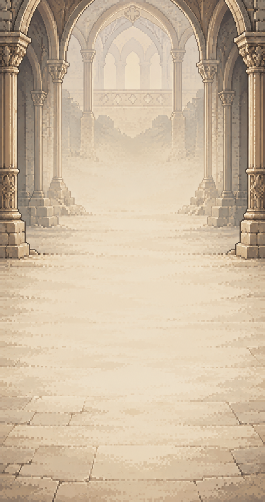
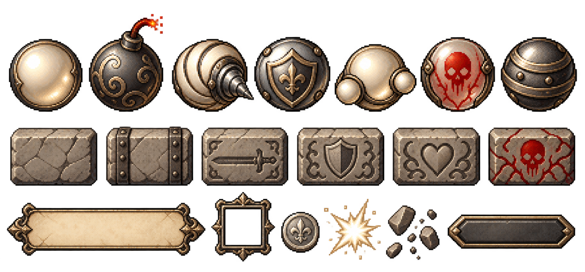
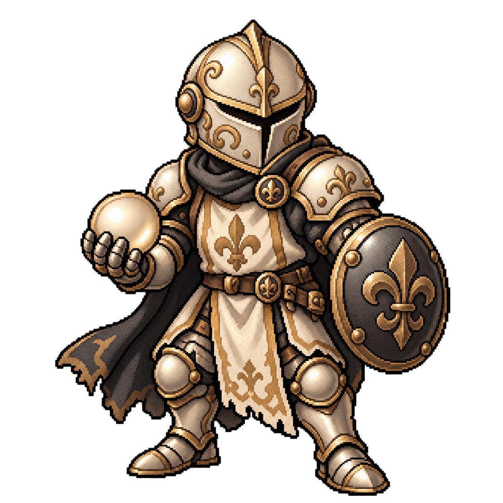
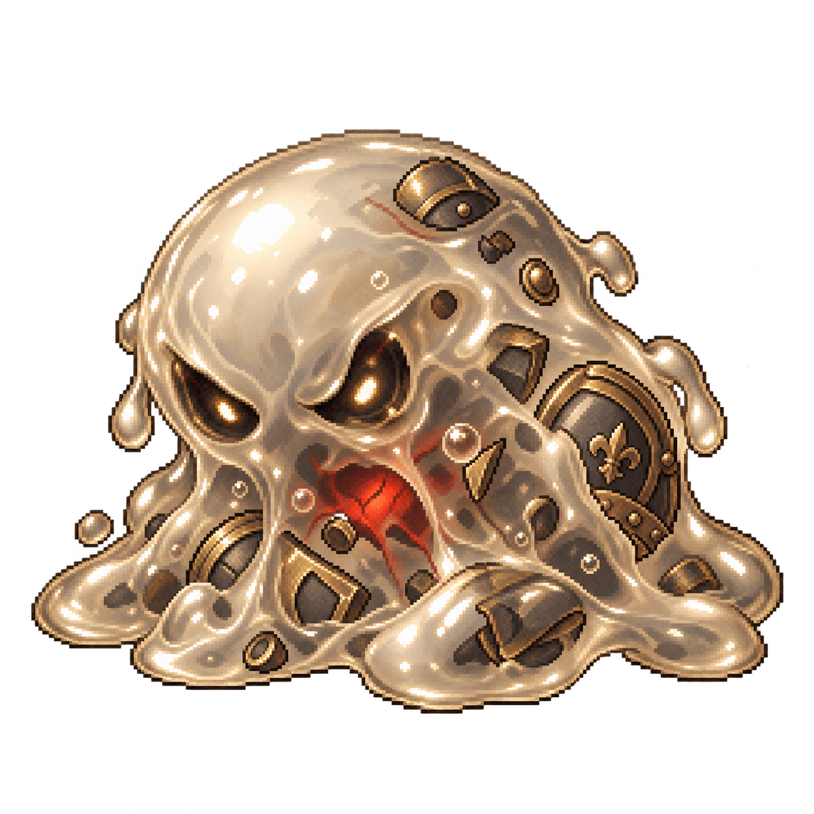
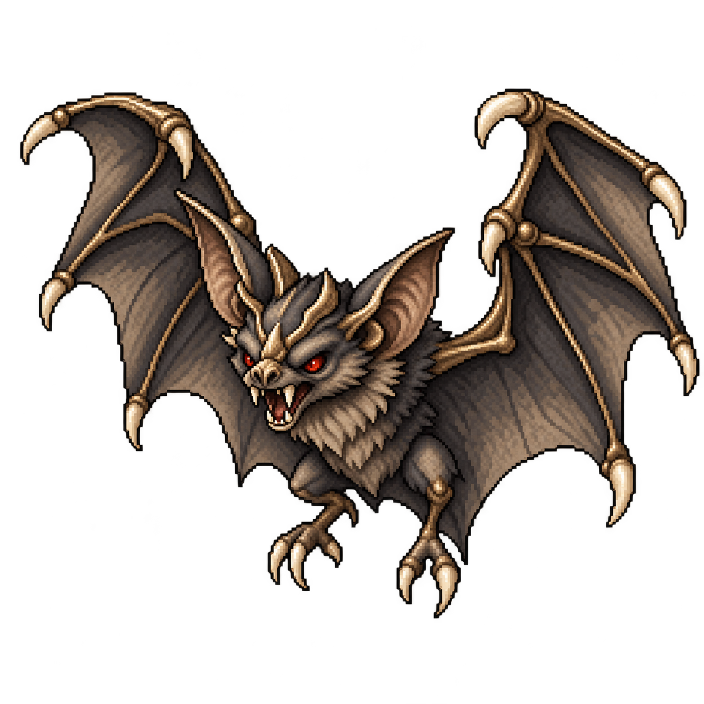
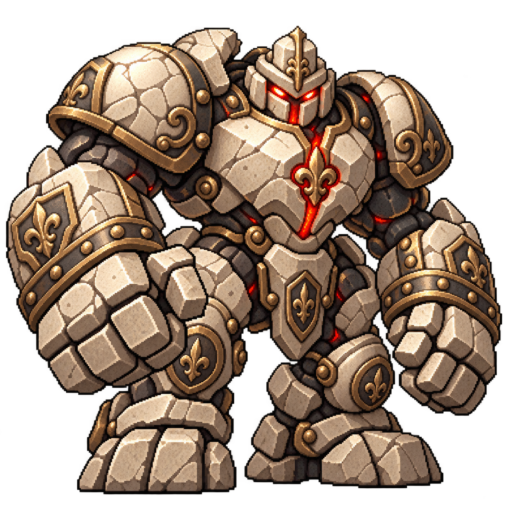
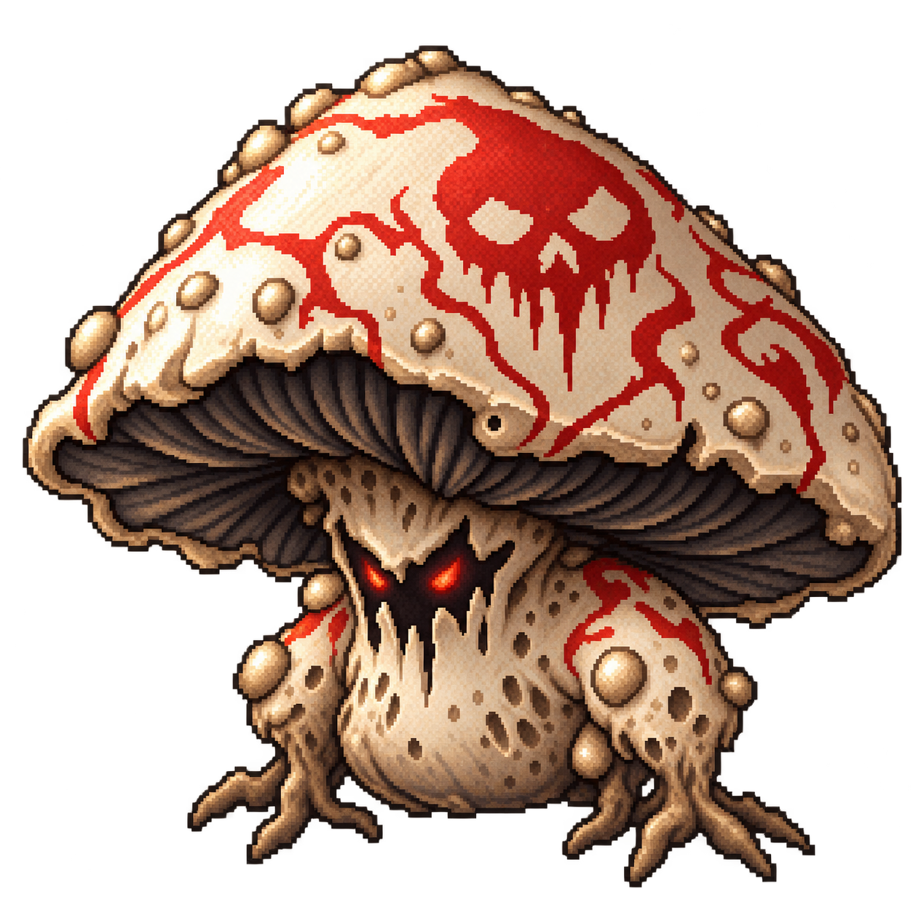
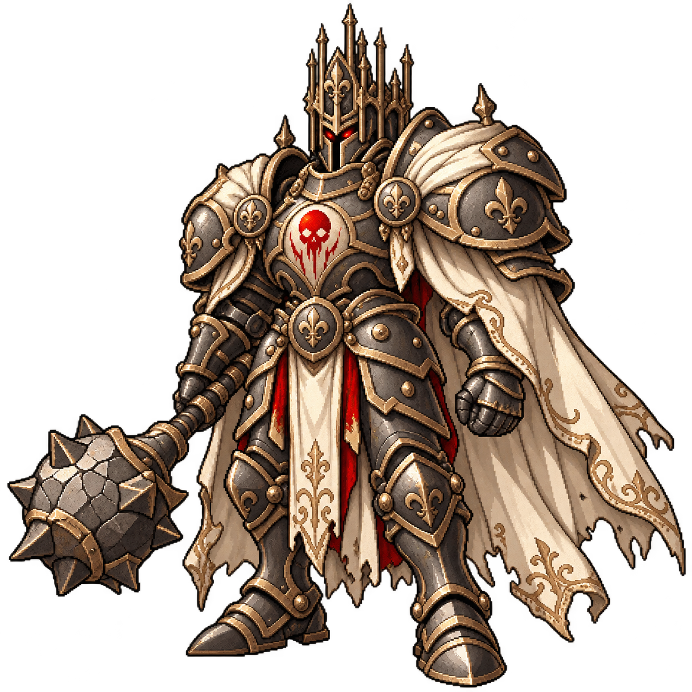

# 일러스트 픽셀 에셋 — 2026-10-06

첨부한 던전 배경·구슬 컬렉션과 같은 질감으로 플레이어 1종, 기존 몬스터 5종을 디자인했다. 이 묶음은 **디자인 원본**이고, 게임에는 `tools/build_game_assets.py`로 줄인 `assets/game/`(약 1.5MB)이 쓰인다.

## 원본

- [던전 배경](../../assets/illustrated/dungeon.png): 사용자 제공 PNG를 그대로 보존.
- [구슬·벽돌·UI 컬렉션](../../assets/illustrated/collection.png): 사용자 제공 PNG를 그대로 보존. 불규칙한 배치이므로 균등 격자 아틀라스로 취급하지 않는다.
- 캐릭터: 내장 imagegen으로 생성한 투명 배경 PNG. 생성 프롬프트는 [prompts.json](../../assets/illustrated/prompts.json), 크기·알파·체크섬은 [manifest.json](../../assets/illustrated/manifest.json)에 기록한다.

## 캐릭터

| 게임 식별자 | 역할과 디자인 | 미리보기 |
|---|---|---|
| `knight` | 플레이어. 상아색 갑옷, 황동 문양, 진주 구슬과 방패 |  |
| `slime` | 금속 파편을 삼킨 반투명 슬라임 |  |
| `bat` | 짙은 날개와 붉은 눈으로 공격성을 표현한 박쥐 |  |
| `golem` | 던전 석조 구조를 이어받은 육중한 골렘 |  |
| `shroom` | 붉은 독성 무늬와 뿌리 발을 가진 독버섯 |  |
| `boss` | 성당형 왕관과 철퇴를 가진 탑의 주인 |  |

## 적용 기준

- 밝은 상아·베이지, 짙은 먹색, 낡은 황동의 명암으로 입체감을 만든다. 붉은색은 몬스터의 위험 신호에 사용한다.
- 투명 알파를 보존한다. 투명 영역이 검게 보이는 뷰어에서도 검정 배경이 실제로 포함된 것은 아니다.
- 캐릭터는 각각 독립 파일이며 프레임 시트가 아니다. 정예·피격·공격·사망 프레임을 포함하지 않는다.
- `js/sprites.js`의 절차적 도트는 지우지 않고 폴백으로 둔다(이미지 로드 전·실패·Node 시뮬레이터).

## 게임 적용 (assets/game)

| 원본 | 게임용 | 쓰이는 곳 |
|---|---|---|
| `dungeon.png` | `dungeon.png` 720×1360, 128색 | 캔버스 전체 배경. 벽돌판은 `--field`로 45% 덮어 조준선 대비 확보, 다크 모드는 `--bg`로 78~84% 덮음 |
| `characters/*.png` | 최대 256px | 전투 캐릭터. 발밑을 y=90에 맞추고 `ART_BOX` 상자 안에 비율대로 그린다 |
| `collection.png` 구슬 7종 | `orb_*.png` 96px | 날아가는 구슬·발사대·HUD·보상 카드·메인 진열 |
| `collection.png` 벽돌 6종 | `brick_*.png` 176×96 | 벽돌(n·stone·atk·def·heal·poison). 원본 3:2를 22:12로 늘림 |
| `collection.png` 코인·불꽃 | `coin.png`·`spark.png` | 코인 칩 아이콘, 구슬 충돌 불꽃 |

- 캔버스 백버퍼를 4배(`RES`)로 늘려 일러스트를 세밀하게 그린다. 게임 좌표·판정은 180×340 그대로라 수치·밸런스 변화는 없다.
- 상태 표현: 피격 = 단색 실루엣 번쩍임(기사 붉은색, 몬스터 흰색), 정예·2페이즈 보스 = 붉은 윤곽, 일반 벽돌 체력 = 어두운 덮개 + 숫자 판.
- 아직 쓰지 않은 조각: 패널·액자·어두운 바·돌 파편(DOM 장식이나 파괴 연출 후보).
- 게임 수치, 충돌 판정, 저장 구조에는 변경이 없다.

## 검증

- 기존 JS 전체 `node --check` 통과.
- `node tools/sim.mjs 60`: 1세션 돌파 25/60(42%), 보스 격파 시 남은 체력 중앙값 33%, 발사당 벽돌 파괴 0.52·천장 타격 0.82. 무작위 표본이며 목표치 달성이나 밸런스 변경의 증거로 해석하지 않는다.
- PNG 형식·크기·알파 채널·사용자 제공 원본 체크섬과 문서 내 파일 링크를 검사한다.
- 런타임 변경이 없어 브라우저 플레이 검증은 수행하지 않았다.
