# 브릭 크롤 에셋 미리보기

> `tools/export_assets.py`가 게임 코드(`js/sprites.js`, `css/style.css`)를 읽어 생성한 파일이다.
> 직접 고치지 말고 게임 코드를 고친 뒤 툴을 다시 돌린다.

## light

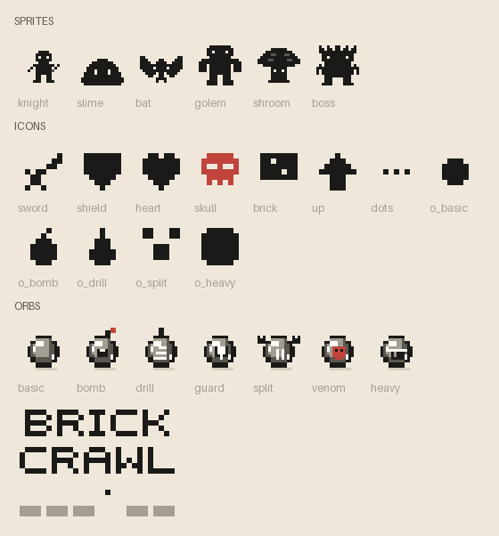

### 연출(GIF)

| 파일 | 미리보기 |
|---|---|
| `fx/attack_bat.gif` | 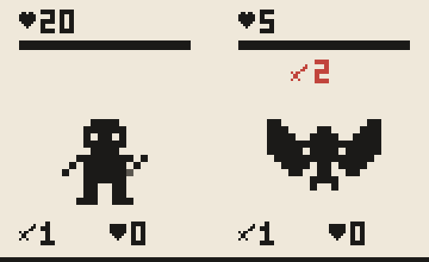 |
| `fx/attack_boss.gif` | 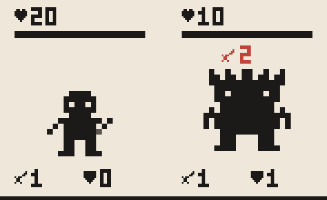 |
| `fx/attack_golem.gif` | 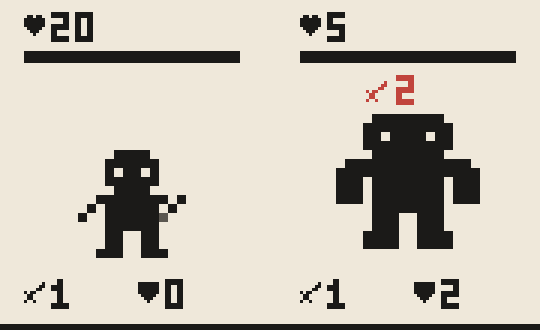 |
| `fx/attack_shroom.gif` | 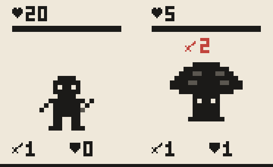 |
| `fx/attack_slime.gif` | 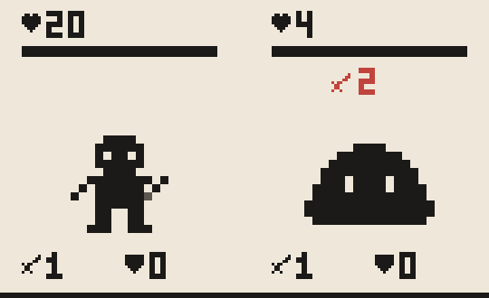 |
| `fx/battle.gif` | 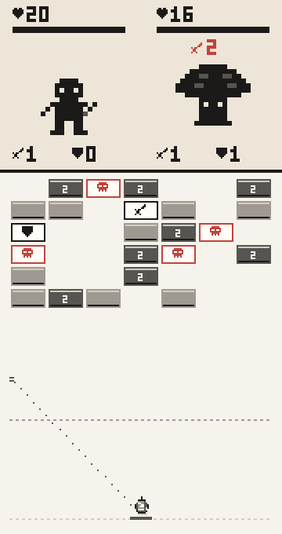 |
| `fx/bomb.gif` | 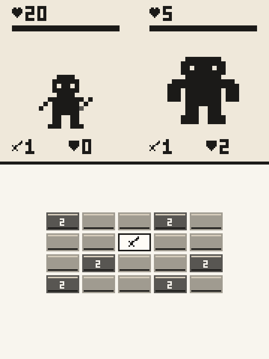 |
| `fx/boss_rage.gif` | 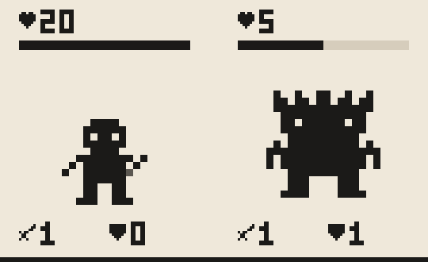 |
| `fx/bricks.gif` | 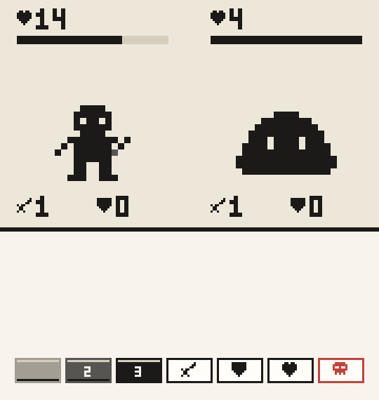 |
| `fx/death_bat.gif` | 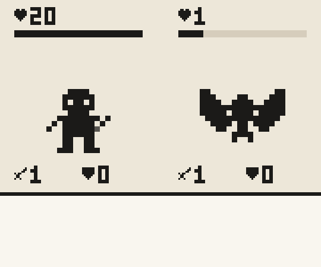 |
| `fx/death_boss.gif` | 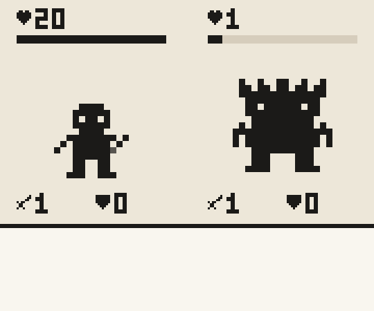 |
| `fx/death_golem.gif` | 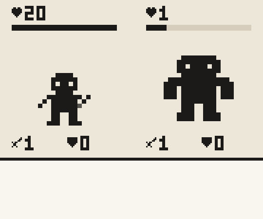 |
| `fx/death_shroom.gif` | 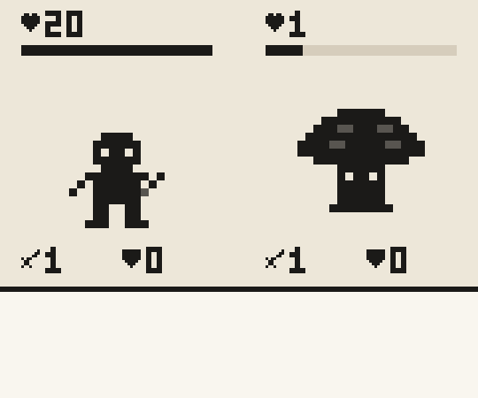 |
| `fx/death_slime.gif` | 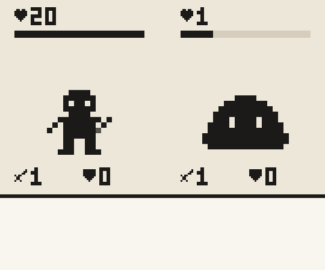 |
| `fx/hit_bat.gif` | 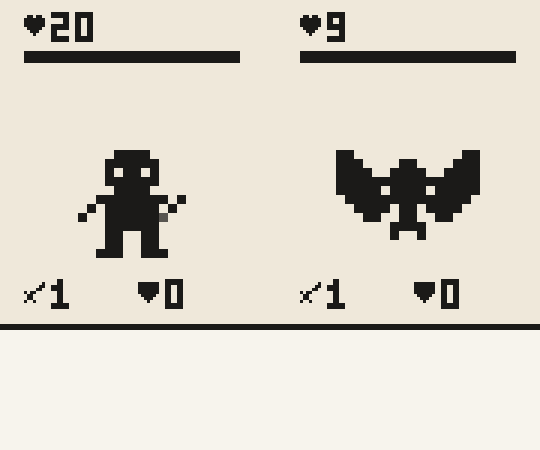 |
| `fx/hit_boss.gif` | 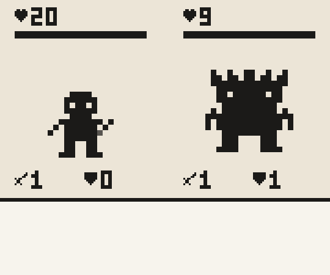 |
| `fx/hit_golem.gif` |  |
| `fx/hit_golem_venom.gif` | 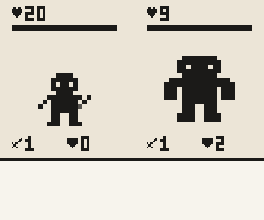 |
| `fx/hit_shroom.gif` | 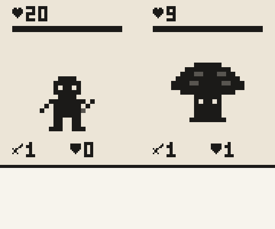 |
| `fx/hit_slime.gif` | 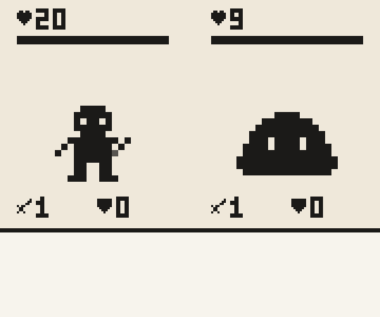 |
| `fx/idle_bat.gif` | 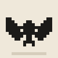 |
| `fx/idle_bat_elite.gif` | 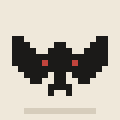 |
| `fx/idle_boss.gif` | 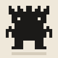 |
| `fx/idle_boss_elite.gif` | 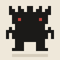 |
| `fx/idle_golem.gif` | 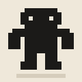 |
| `fx/idle_golem_elite.gif` | 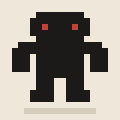 |
| `fx/idle_knight.gif` | 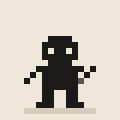 |
| `fx/idle_shroom.gif` |  |
| `fx/idle_shroom_elite.gif` | 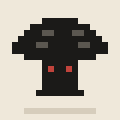 |
| `fx/idle_slime.gif` | 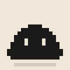 |
| `fx/idle_slime_elite.gif` | 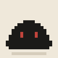 |
| `fx/orb_basic.gif` | 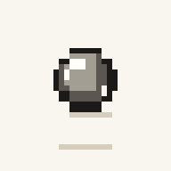 |
| `fx/orb_bomb.gif` | 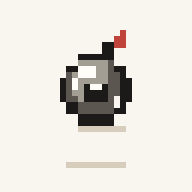 |
| `fx/orb_drill.gif` | 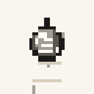 |
| `fx/orb_guard.gif` | 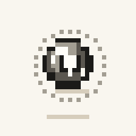 |
| `fx/orb_heavy.gif` | 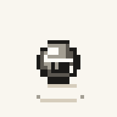 |
| `fx/orb_split.gif` | 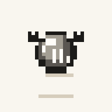 |
| `fx/orb_venom.gif` | 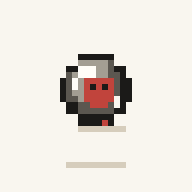 |

## dark

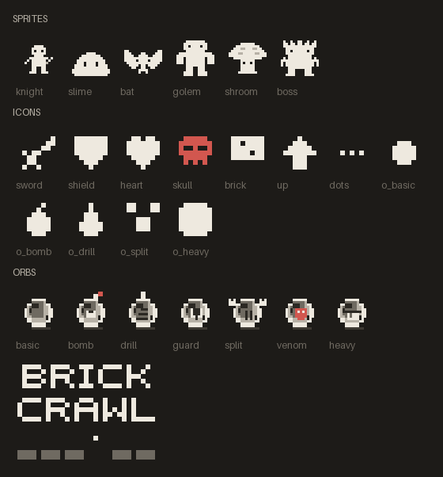

### 연출(GIF)

| 파일 | 미리보기 |
|---|---|
| `fx/attack_bat.gif` | 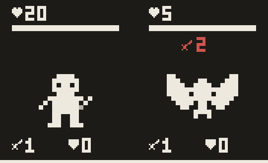 |
| `fx/attack_boss.gif` | 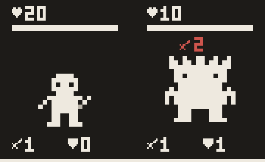 |
| `fx/attack_golem.gif` | 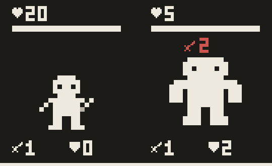 |
| `fx/attack_shroom.gif` | 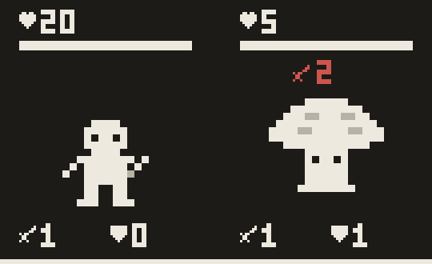 |
| `fx/attack_slime.gif` | 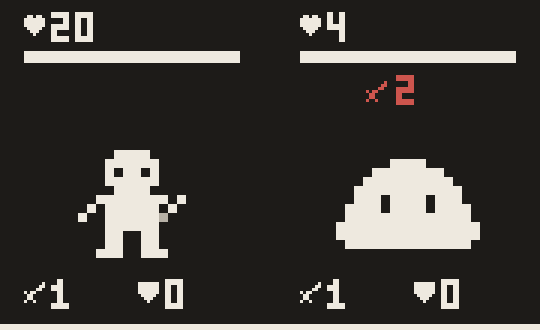 |
| `fx/battle.gif` | 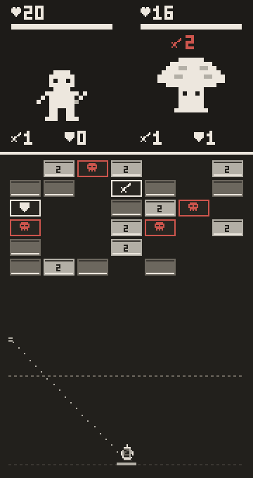 |
| `fx/bomb.gif` | 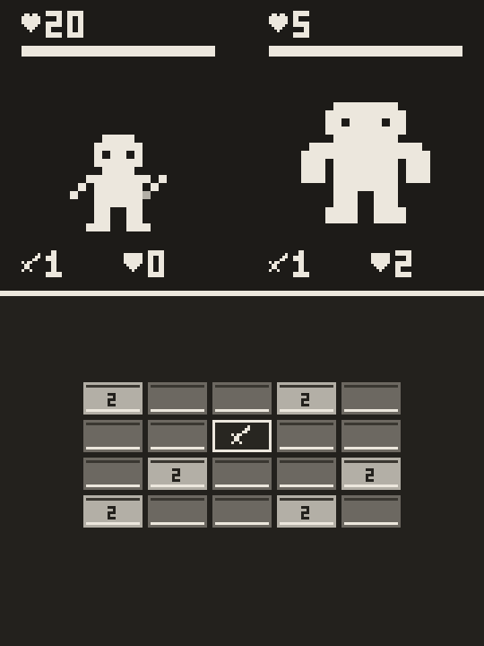 |
| `fx/boss_rage.gif` | 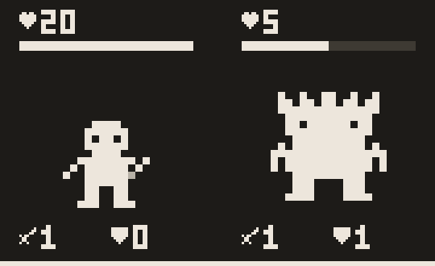 |
| `fx/bricks.gif` | 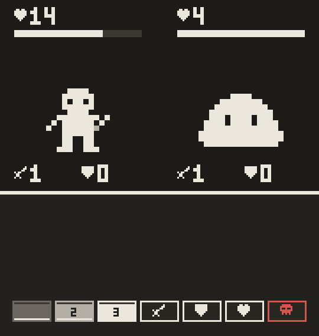 |
| `fx/death_bat.gif` | 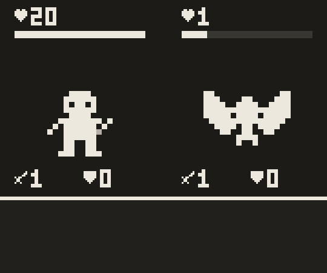 |
| `fx/death_boss.gif` | 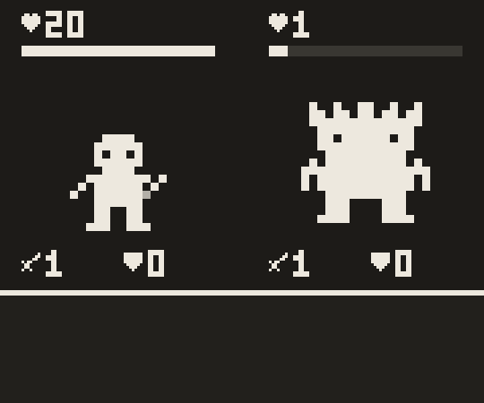 |
| `fx/death_golem.gif` | 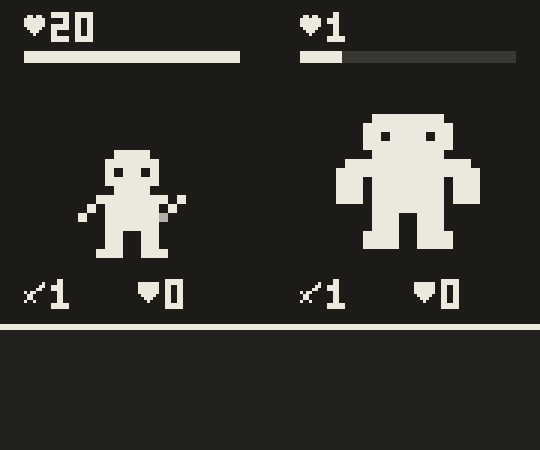 |
| `fx/death_shroom.gif` |  |
| `fx/death_slime.gif` |  |
| `fx/hit_bat.gif` |  |
| `fx/hit_boss.gif` |  |
| `fx/hit_golem.gif` |  |
| `fx/hit_golem_venom.gif` |  |
| `fx/hit_shroom.gif` |  |
| `fx/hit_slime.gif` |  |
| `fx/idle_bat.gif` |  |
| `fx/idle_bat_elite.gif` |  |
| `fx/idle_boss.gif` |  |
| `fx/idle_boss_elite.gif` |  |
| `fx/idle_golem.gif` |  |
| `fx/idle_golem_elite.gif` |  |
| `fx/idle_knight.gif` |  |
| `fx/idle_shroom.gif` |  |
| `fx/idle_shroom_elite.gif` |  |
| `fx/idle_slime.gif` |  |
| `fx/idle_slime_elite.gif` |  |
| `fx/orb_basic.gif` |  |
| `fx/orb_bomb.gif` |  |
| `fx/orb_drill.gif` |  |
| `fx/orb_guard.gif` |  |
| `fx/orb_heavy.gif` |  |
| `fx/orb_split.gif` |  |
| `fx/orb_venom.gif` |  |
